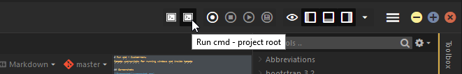
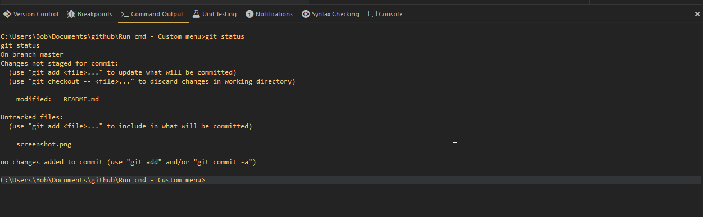

# Windows Run cmd - Custom-toolbar
Komodo userscripts for running windows cmd inside komodo

## Screenshots

## Instalation
Download the [latest release](https://github.com/babobski/Run-cmd-Custom-menu/releases/latest).   
Unizp the folder on you're system.  
In you're toolbox, select the option **Import folder from file system** and select the "Run cmd" folder.  
After the import you need to reboot komodo before the toolbar will be shown in the menu.
